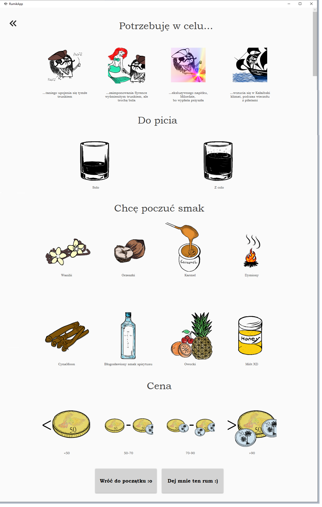
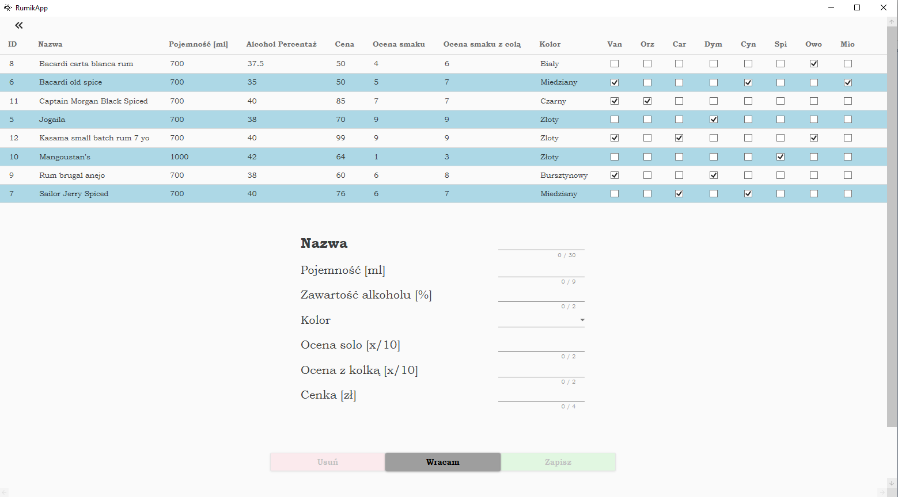

#   Hi, this is **RumikApp**

At the begining I'd like to mention that it's my first personal project. Repository consists of 3 main directories:

1. RumikApp.UI - UI of the application
2. RumikApp.Core - All main logic
3. RumikApp.Infrastructure - All logic used to load or save database entries
4. RumikApp.Tests - Unit tests

## Simply - **RumikApp** is the app where you go to if you are looking for a Rum

App allows user to:

-   Find a rum depending on his current needs,
-   Browse internal database,
-   Save new entries.

# Contents page

1.  [Technologies](#Technologies)
2.  [App presentation](#AppPresentation)

#   Technologies 

## Generall 

Whole app is based on .NET Framework 4.7.2 and C#.

Below I'm listing couple of technologies that I learned during this project:

-   Linq
-   MVVM
-   Autofac 
-   Xunit and Moq
-   Asynchronous programming

At this point app supports only Polish language.

## Future plans

I'm planning to implement Entity framework and SQlite.

#   App presentation 

Below you will find couple of screens from RumikApp itself

**Fig.1** Startup page

**Fig.2** Database view

**Fig.3** Poll

**Fig.4** My rum Cabinet

**Fig.5** Random entry

**Fig.6** Add new entry